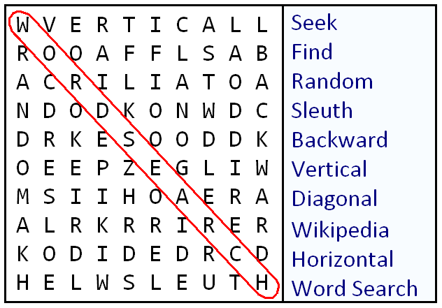

# Word Search

Word search is a C++ program that will generate and solve word search puzzles.

## Description

A word search is a puzzle game that involves a grid of alphabetic letters.

The goal of the game is to find the given words hidden inside the grid.

One of the primary purposes of this program is to allow me to improve and refine my C++ and source control skillset.

## Project Status

This project is in active development, with the minimum goal of weekly commits.
